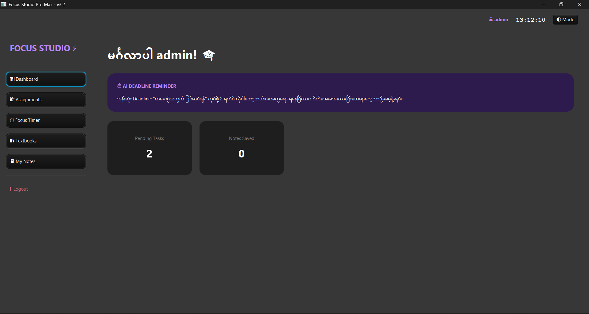
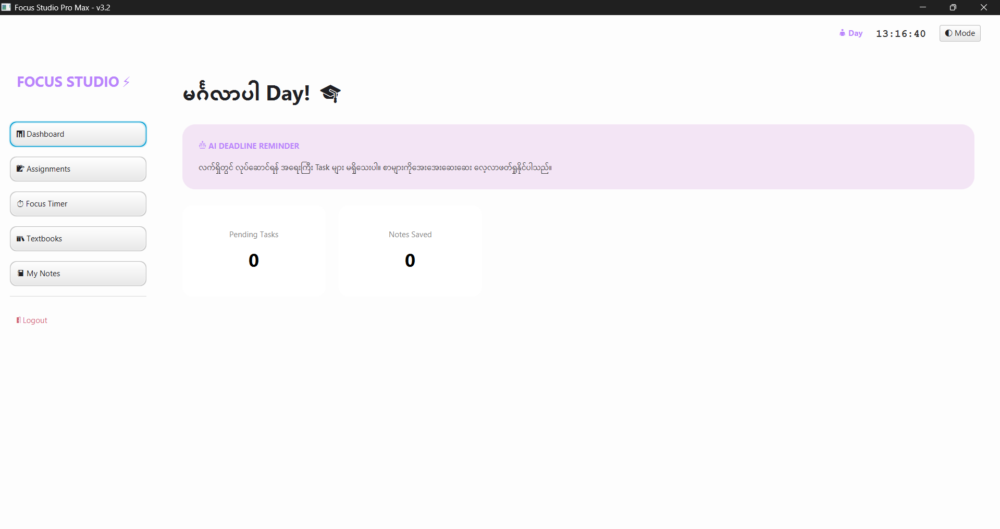
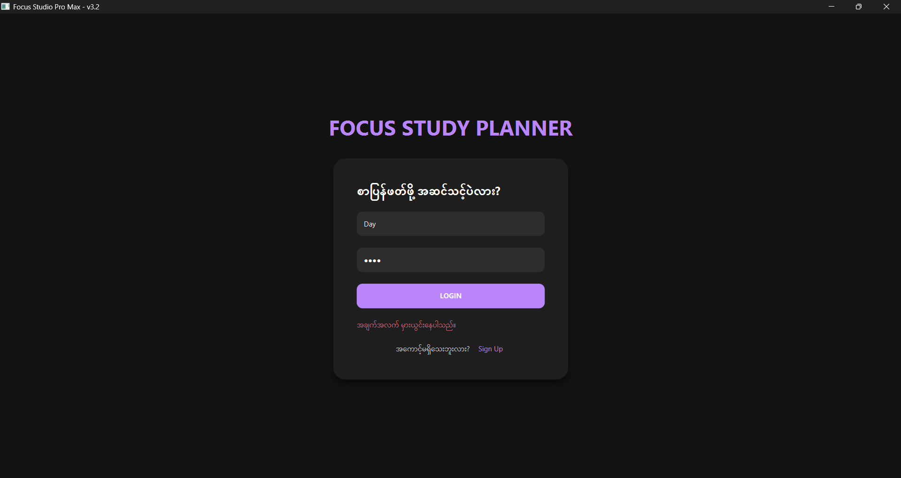
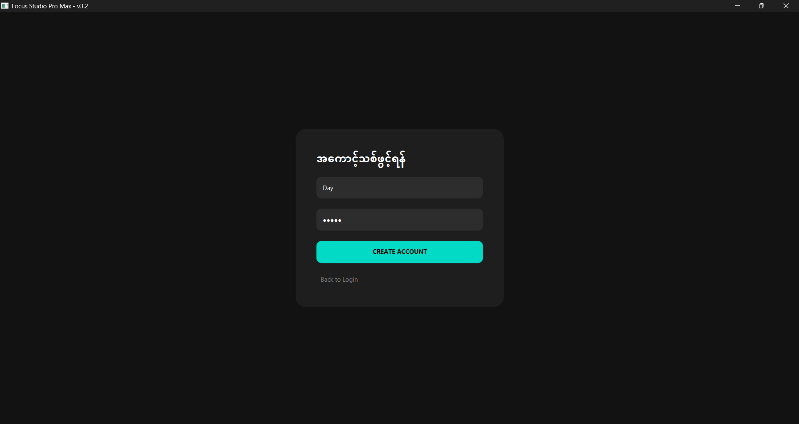
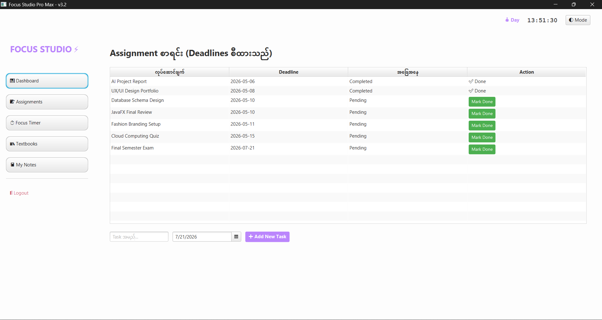
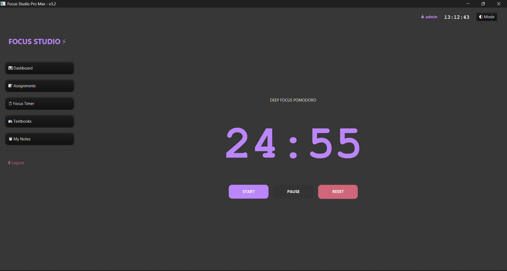
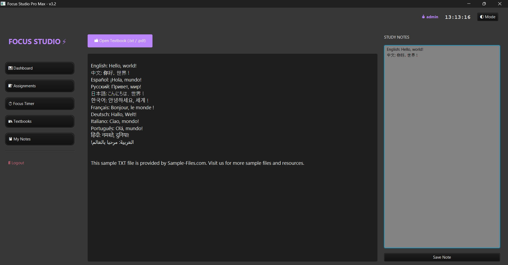
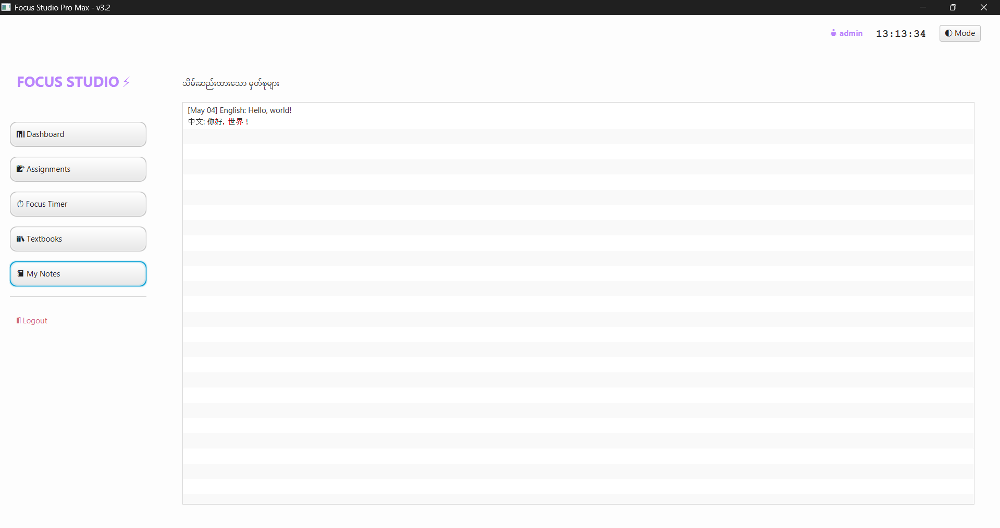

# ⚡ Focus Studio Pro Max (v3.2)

Focus Studio Pro Max was born out of my own struggle to balance a heavy academic workload with effective study sessions. It’s an advanced, all-in-one productivity suite built with JavaFX, designed to bridge the gap between simple task management and active learning. I built this to solve the chaos of switching between multiple apps just to get a single study session done.

## 💡 Why I built this?
When I’m buried under a mountain of assignments, it’s easy to feel overwhelmed and lose track of what’s urgent. I kept forgetting where I wrote down my notes and couldn't find a single workspace that handled both my deadlines and my reading materials. So, I built this. It’s now a staple in my daily routine, and I’m sharing it here hoping it helps you stay as organized as it has helped me.

## ✨ Key Features (I implemented these with ☕)

* **Intelligent Task Management**: Beyond a simple to-do list, this AI-driven system automatically tracks your deadlines and provides prioritized reminders, ensuring you never miss a submission.
* **Deep Focus Engine**: A fully customizable Pomodoro timer designed to optimize study sessions, complete with Pause, Resume, and Reset functionalities to protect your deep-work flow.
* **Unified Study Workspace**: The integrated Document Viewer (supporting PDF and Text files) allows you to read your course materials directly within the app, while the built-in Notes module lets you capture study insights instantly—no more tab-switching!
* **Clean & Modern Architecture**: Developed with performance in mind, featuring a seamless dark/light mode UI to reduce eye strain during long study hours.

---

##  Screenshots

| Dashboard (Dark) | Dashboard (Light) |
| :--- | :--- |
|  |  |

| Login Page | Sign-up Page |
| :--- | :--- |
|  |  |

| Assignment Manager | Pomodoro Timer |
| :--- | :--- |
|  |  |

| Text Book | Note Taking |
| :--- | :--- |
|  |  |
---

##  How to Run?
If you'd like to try it out on your machine, here is how you can set it up:

1. **Clone the repo**: 
   ```bash
   git clone [https://github.com/Day-d/focus-studio-pro.git](https://github.com/Day-d/focus-studio-pro.git)

2. Setup: Make sure you have Java JDK 17+ and the JavaFX SDK installed.

3. Compile:
    ```bash
    javac --module-path /path/to/javafx-sdk/lib --add-modules javafx.controls FocusStudio.java

4. Run:
    ```bash
    java --module-path /path/to/javafx-sdk/lib --add-modules javafx.controls FocusStudio

🛠 Tech Stack

Language: Java
UI: JavaFX (Modern Styling)
Design Philosophy: Minimalist & Focus-driven

🤝 Let's Connect
I'm constantly looking to improve this tool. If you have any feedback, bug reports, or ideas for new features, feel free to open an issue or submit a Pull Request. I’d love to see how you use it!